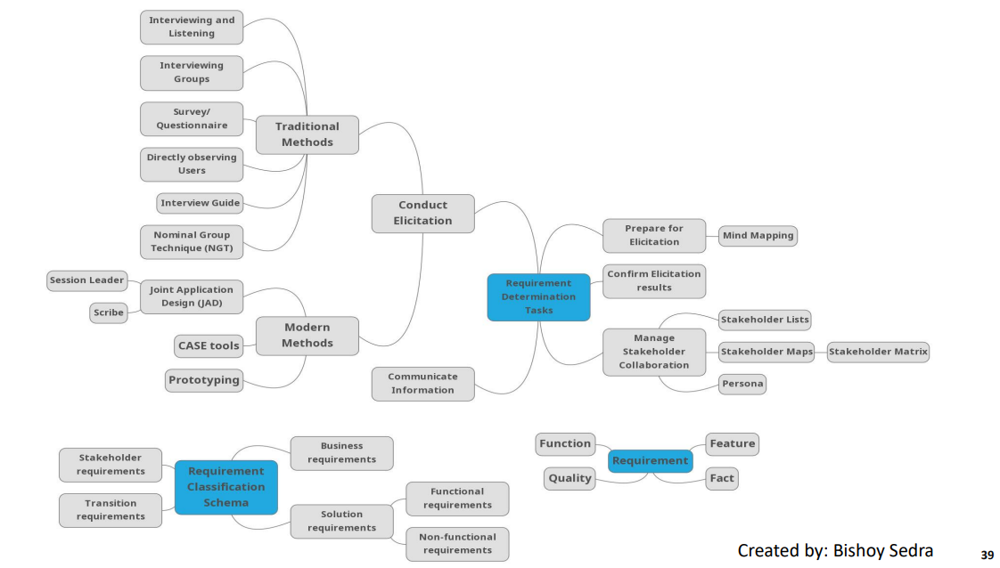

### Analysis Phase  
- **Who will use the system.**  
- **What the system will do.**  
- **Where and when it will be used.**  

**Two Sub-phases:**  
1. **Requirements Determination:**  
   - Careful study of the organization's current procedures and the information systems used to perform organizational tasks.  
2. **Requirements Structuring:**  
   - Relationships between requirements and eliminating redundancy.  

---

### SRS (Software Requirement Specification)  
- The main aim of determining the information requirements of an organization is to prepare a precise SRS understood by the user.  
- **Ideal SRS Document should:**  
  - Be complete, unambiguous, and jargon-free.  
  - Specify operational and strategic information requirements.  
  - Solve possible disputes between users and analysts.  
  - Use graphical aids to simplify understanding and design.  

---

### Requirement Determination Process  
1. **Prepare for Elicitation**  
2. **Conduct Elicitation**  
3. **Confirm Elicitation Results**  
4. **Communicate Information**  
5. **Manage Stakeholder Collaboration**  

---

### Conduct Elicitation  
- **Purpose:** To draw out, explore, and identify information relevant to the change.  
- **Elicitation Techniques:**  
	- **Traditional Methods:**  
		- Interviewing and Listening  
		- Interviewing Groups  
		- Survey/Questionnaire  
		- Ethnography  
		- Analyzing procedures and other documents  
	- **Modern Methods:**  
		- Joint Application Design (JAD)  
		- CASE tools  
	    - Prototyping  

---

### Traditional Requirements Determination Methods  
- Interviewing individuals  
- Interviewing groups  
- Survey/Questionnaire  
- Ethnography  
- Studying business documents  

---

### What is Interviewing?  
- Dialogue with stakeholders to obtain their requirements.  
- During interviewing, you gather facts, opinions, and observe body language, emotions, and other signs of what people want and how they assess current systems.  

---

### Interview Guide  
- **Interview Guide:** A document for developing, planning, and conducting an interview.  
- Each question in an interview guide can include both verbal and non-verbal information.  
- **Contents:**  
	- Basic information on who is being interviewed and when.  
	- Major objectives for the interview.  
	- Reminder notes on key information about the interviewee (e.g., job history, known positions taken on issues, role with the current system).  
	- Agenda for the interview with approximate time.  

---

### Choosing Interview Questions  
- **Open-ended Questions:**  
	- Used to probe for information where you cannot anticipate all possible responses.  
	- Example: "What would you say is the best thing about the information system you currently use to do your job?"  
	- The person being interviewed is encouraged to talk about whatever interests him or her within the general bounds of the question. 
	- You must react quickly to answers and determine whether or not any follow-up questions are needed for clarification or elaboration. 
	- Sometimes body language will suggest that a user has given an incomplete answer.
	- **Advantages:**  
		- Previously unknown information can surface.  
		- Often put interviewees at ease.  
		- Give interviewees a sense of involvement and control.  
	- **Disadvantages:**  
		- Time-consuming to answer.  
		- Difficult to summarize.  

- **Closed-ended Questions:**  
	- Provide a range of answers from which the interviewee may choose.  
	- Which of the following would you say is the one best thing about the information system you currently use to do your job (pick only one)? 
		a. Having easy access to all of the data you need 
		b. The system’s response time 
		c. The ability to access the system from remote locations
	- **Advantages:**  
		- Work well when major answers are well known.  
		- Do not require much time.  
		- Easy to begin an interview and determine which line of open-ended questions to pursue.  
	- **Disadvantages:**  
		- Useful information may be overlooked if it doesn’t fit the defined answers.  

---

### Guidelines for Effective Interviewing  
- Plan the interview.  
	- Prepare the interviewee: appointment, priming questions.  
	- Prepare agenda, checklist, questions.  
- Listen carefully and take notes (tape record if permitted).  
- Review notes within 48 hours.  
- Be neutral.  

---

### Advantages/Disadvantages of Individual Interviews  
- **Advantages:**  
	- Easier to schedule than group interviews.  
- **Disadvantages:**  
	- Contradictions and inconsistencies between interviewees.  
	- Follow-up discussions are time-consuming.  

---

### Group Interviews  
- Interview several key people together.  
- **Advantages:**  
  - More effective use of time.  
  - Can hear agreements and disagreements at once.  
  - Opportunity for synergies.  
- **Disadvantages:**  
  - More difficult to schedule than individual interviews.  

---

### Nominal Group Technique (NGT)  
- A facilitated process that supports idea generation by groups.  
- **Process:**  
	- Members come together as a group but initially work separately.  
	- Each person writes ideas.  
	- Facilitator reads ideas out loud, and they are written on a blackboard.  
	- Group discusses the ideas.  
	- Ideas are prioritized, combined, selected, reduced.  
- **In requirement determination context:**  
	- Applies to problems with the existing system or ideas for new features in the system being developed.  
	- The end result is a list of either problems or features that group members themselves generated and prioritized.  

---

### Survey/Questionnaire  
- Used to elicit business analysis information, including information about customers, products, work practices, and attitudes, from a group of people in a structured way and in a relatively short period of time.  
- **Types of Questions:**  
  - **Close-ended:** Easier to analyze because they can be tied to numerical coefficients.  
  - **Open-ended:** Useful when the issues are known, and the range of user responses is not; more difficult and time-consuming.  

**Strengths:**  
- Quick and relatively inexpensive to administer.  
- Easier to collect information from a larger audience.  
- Suitable for stakeholders who are geographically dispersed.  
- Effective for obtaining quantitative data for statistical analysis.  

**Limitations:**  
- Specialized skills in statistical sampling methods are needed.  
- Response rates may be too low for statistical significance.  
- Ambiguous questions may be unanswered or answered incorrectly.  
- Require follow-up questions or more survey iterations depending on the answers provided.  

---

### Ethnography  
- Watching users do their jobs.  
- **Advantages:**  
  - Can provide more accurate information than self-reporting.  
- **Disadvantages:**  
  - Observation can cause people to change their normal operating behavior.  
  - Observation yields only a small segment of data from a possibly vast variety of data sources.  
  - Not continuous; you receive only a snapshot image of a person or task.  
  - Observation is very time-consuming.  

---

### Analyzing Procedures and Other Documents  
- Review of existing business documents:
- Can give a historical and “formal” view of system requirements.  
- **Types of information to be discovered:**  
	- Problems with the existing system (e.g., missing information).  
	- Opportunity to meet new needs (e.g., analysis of sales based on customer type).  
	- Names of key individuals (e.g., sales manager who studies buying behavior).  
	- Reasons for current system design (e.g., data about a customer’s purchase of competitors’ products were not available).  
	- Rules for processing data (e.g., each customer is assigned exactly one sales department staff member as a primary contact).  

**Four types of useful documents:**  
1. **Written work procedures:** Describes how a job is performed, including data and information used and created.  
2. **Business forms:** Explicitly indicate data flow in or out of a system.  
3. **Reports:** Enable the analyst to work backward from the report to the data that generated it.  
4. **Description of the current information system:** Flowcharts, data dictionaries, CASE tool reports, etc.  

---

### Potential Problems with Procedure Documents  
- May involve duplication of effort.  
- May have missing procedures.  
- May be out of date.  
- **Formal vs. Informal Systems:**  
  - **Formal:** The official way a system works as described in the organization's documentation.  
  - **Informal:** The way a system actually works in practice (revealed through interviews and observation).  

---

### Modern Methods for Determining Requirements  
1. **Joint Application Design (JAD):**  
   - Brings together key users, managers, and systems analysts.  
   - Purpose: Collect system requirements simultaneously from key people.  
   - Conducted off-site.  
2. **CASE Tools:**  
   - Used to analyze existing systems.  
   - Help discover requirements to meet changing business conditions.  
   - Examples: Rational Rose, Visio, etc.  
3. **Prototyping:**  
   - Iterative development process.  
   - A basic working version of the system is built.  
   - Refine understanding of system requirements in concrete terms.  

---

### Joint Application Design (JAD)  
- **Purpose:** To collect system requirements simultaneously from key people involved with the system (users, managers, and systems analysts).  
- **Process:**  
  - Team members meet in isolation for an extended period.  
  - Usually conducted at a location other than the place where the people involved normally work.  
  - Highly focused and structured.  
  - Allows for resolving conflicts or understanding why a conflict may not be simple to resolve.  

**JAD Participants:**  
- **Session Leader:** Facilitates group process.  
- **Users:** Active, speaking participants.  
- **Managers:** Active, speaking participants.  
- **Sponsor:** High-level champion, limited participation.  
- **Systems Analysts:** Should mostly listen.  
- **Scribe:** Records session activities.  
- **IS Staff:** Should mostly listen.  
**End Result** :
- Documentation detailing existing system 
- Features of proposed system 
**CASE Tools During JAD**:
- CASE tools are used 
- Enables analysts to enter system models directly into CASE during the JAD session 
- Screen designs and prototyping can be done during JAD and shown to users

---

### Prototyping  
- Used to elicit and validate stakeholder needs through an iterative process that creates a model or design of requirements.  
- **Advantages:**  
  - Quickly converts requirements to a working version of the system.  
  - Provides a visual representation for the future state.  
  - Allows for early input/feedback in the design process.  
- **Drawbacks:**  
  - Difficult to adapt to a more general user audience.  
  - Unrealistic expectations for the final solution.  
  - Focus on design specifications rather than non-functional requirements.  

---

### Deliverables of Requirements Determination  
- **From interviews and ethnography:**  
  - Interview transcripts, observation notes, meeting minutes.  
- **From existing written documents:**  
  - Mission and strategy statements, business forms, procedure manuals, job descriptions, training manuals, system documentation, flowcharts.  
- **From computerized sources:**  
  - JAD session results, CASE repositories, system prototype displays, and reports.  

---

### Requirements Elicitation Techniques Comparison  
| **Technique**               | **Advantages**                                                                 | **Disadvantages**                                                                 |
|-----------------------------|-------------------------------------------------------------------------------|----------------------------------------------------------------------------------|
| **Interviewing**            | Detailed, in-depth information; builds rapport with stakeholders.             | Time-consuming; may be biased by interviewer or interviewee.                     |
| **Survey/Questionnaire**    | Quick, inexpensive; collects data from a large audience.                      | Low response rates; ambiguous questions may lead to incorrect answers.           |
| **Ethnography**             | Provides accurate, real-world insights into user behavior.                    | Time-consuming; may alter normal user behavior.                                  |
| **JAD**                     | Efficient; resolves conflicts; involves key stakeholders.                     | Difficult to schedule; requires skilled facilitation.                            |
| **Prototyping**             | Visual representation; early feedback; iterative refinement.                  | May lead to unrealistic expectations; difficult to scale for large systems.      |

---

### Questions  
1. **Which requirements elicitation technique includes observing users work in their own environment?**  
   - **Answer:** Ethnography.  

2. **Elaborate on the advantages of using open-ended questions in the interview process.**  
   - **Answer:** Open-ended questions allow for previously unknown information to surface, put interviewees at ease, and give them a sense of involvement and control in the interview.  

3. **Which requirements elicitation technique works best to obtain quantitative data for statistical analysis?**  
   - **Answer:** Survey/Questionnaire.  

4. **List three modern requirements determination techniques.**  
   - **Answer:** Joint Application Design (JAD), CASE tools, Prototyping.  

5. **When do business analysts use prototypes?**  
   - **Answer:** Business analysts use prototypes when user requests are not clear, few users are involved, designs are complex, or there is a history of communication problems between analysts and users.  

---

### References  
- **Modern System Analysis and Design, Fourth Edition**, Joseph S. Valacich, Joey F. George, Jeffrey A. Hoffer.  
- **BABOK, A Guide to the Business Analysis Body of Knowledge**, International Institute of Business Analysis (IIBA).  

---
