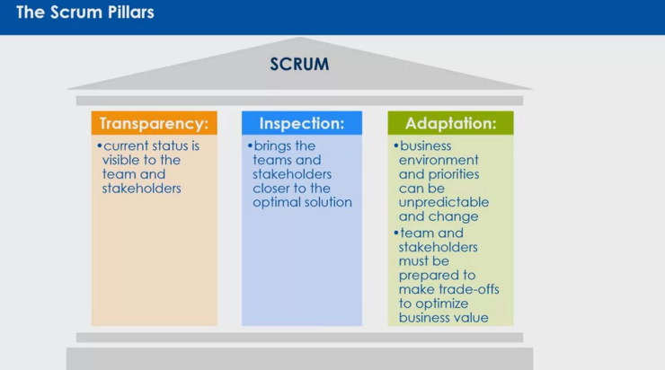

# Scrum Process Framework
## Agenda

1. Waterfall model.
2. What's/Why Agile?
3. Agile Manifesto/Principles of Agile.
4. What's/Why Scrum?
5. Scrum overview/events and estimation.
6. Tools.
7. References.
---
## 01 SDLC/Stakeholders

---

## WATERFALL

---

## 02 Agile? What's/Why

---

### What's/Why Agile?

- **Linear vs Iterative Development**:
  - **Linear Execution**: Deviation from the initial plan.
  - **Iterative Development**: Changes are expected, and the goal evolves.

---

### What's/Why Agile?

- **Agile**:
  - 9% Failed
  - 42% Successful
  - 49% Challenged

- **Waterfall**:
  - 29% Failed
  - 14% Successful
  - 57% Challenged

---

## 03 Agile Manifesto/Principles of Agile

---

### Manifesto For Agile

**Agile Manifesto**:  
We are uncovering better ways of developing software by doing it and helping others do it. Through this work, we have come to value:

- **Individuals and interactions** over processes and tools.
- **Working software** over comprehensive documentation.
- **Customer collaboration** over contract negotiation.
- **Responding to change** over following a plan.

That is, while there is value in the items on the right, we value the items on the left more.

---

## 03 What's/Why Scrum?

---

### What's/Why Scrum?

- **AGILE METHODS AND PRACTICES**:  
  Scrum and related variants continue to be the most common Agile methodologies used by respondents' organizations.

---

### What’s/Why Scrum?

- Scrum is a framework that helps teams work together.
- Scrum describes a set of meetings, tools, and roles that work in concert to help teams structure and manage their work.
- Scrum is a subset of Agile. It is a lightweight process framework for agile development, and the most widely-used one.
- Increase the quality of the deliverables.
- Overcome better with change (and expect the changes).
- Provide better estimates while spending less time creating them.
- Be more in control of the project schedule and state.

---

### What's/Why Scrum?

- **CUSTOMER**: More responsive to requests.
- **DEVELOPMENT TEAMS**: Enjoy development work, training in daily meetings.
- **SCRUMMASTER**: Focused on high-value features.
- **PRODUCT OWNER**: Development work aligns with customer needs.
- **PMOS AND C-LEVEL EXECUTIVES**: High visibility of daily project development.

---

## Scrum Pillars

- **Transparency**: Current status is visible to the team and stakeholders.
- **Inspection**: Brings the teams and stakeholders closer to the optimal solution.
- **Adaptation**: Business environment and priorities can be unpredictable, and change must be prepared to make trade-offs to optimize business value.

---

## 04 Overview Scrum

---

---

### Scrum Overview - Scrum Team

---

### Scrum Overview - Scrum Team

---

### Scrum Overview - Scrum Team

- **The Scrum Master as a Servant Leader**:
  - Seeks a common understanding.
  - Supports team members by listening.
  - Encourages openness.
  - Gets the team help when needed.

---

### Scrum Overview - Scrum Team

- **Scrum Roles: The Product Owner**:
  - Is the customer proxy.
  - Participates in all team meetings.
  - Defines and ensures value is delivered to the business.
  - Prioritizes the team's work.
  - Approves product releases.

---

### Scrum Overview - Backlog

- **The Sprint Backlog**:
  - Is the Sprint plan the team constructs.
  - Is finalized during Sprint planning.
  - Equals the team's total estimated points of the User Stories.

---

### Scrum Overview - Estimations

- **Story Points**:
  - Estimate Stories with relative Story points.
  - A Story point represents:
    - How big is the User Story effort.
    - How much is unknown.
  - The bigger the effort, the higher the estimation in Story Points.
  - The more unknowns, the higher the estimation in Story Points.
  - The most popular Story Point scale is the Rounded, or Modified, Fibonacci scale: 1, 2, 3, 5, 8, 13, 20, 40, 100.

---

### Scrum Overview - Estimations

- **Story Points**:
  - A 1-point User Story is a User Story that can be coded and tested in 1 day.
  - Any User Story that is about double the effort is a 2-point User Story.
  - Any User Story that is about triple the effort of the 1-point User Story is a 3-point User Story.

---

### Scrum Overview - Events

- **Scrum Events**:
  - Sprint planning.
  - Daily Stand-up.
  - Sprint Review.
  - Sprint Retrospective.

---

### Scrum Overview - Events

- **The Sprint**:
  - Is the product's development iteration.
  - Is the foundation of Agile economics.
  - Is a combination of a set timebox and a required set of events or meetings.
  - Supports the iterative development which allows the team to build, learn, and collaborate with the customer.

---

### Scrum Overview - Events

- **The Sprint Planning Meeting**:
  - Is where the team plans what it hopes to accomplish.
  - When the team estimates User Stories, the estimation is done.

---

### Scrum Overview - Events

- **Daily Stand-up (DSU)**:
  - Is the team's mini-status meeting and planning session.
  - Is timeboxed for no more than 15 minutes.
  - Each team member answers the 3 questions:
    - Yesterday, I completed...
    - Today, I am working on...
    - Here are my impediments and blockers...

---

### Scrum Overview - Events

- **The Sprint Review Meeting**:
  - Is where the team runs and demonstrates the current product to themselves, the Product Owner, and any relevant stakeholders.
  - The product must be packaged and running in the intended architecture.
  - Is the formal time to “Check” the product and validate progress, as the Agile Manifesto states.
  - Teams demonstrate every Story, and knowledge gained from learning activities.
  - Timebox is 1 to 2 hours.

---

### Scrum Overview - Events

- **The Sprint Retrospective Meeting**:
  - **START**: “What should we start doing?”
    - List ideas/items:
      - Things that are not being done but should be done.
      - Things to begin doing to get better results.
      - Things worth trying or experimenting for better results.
  - **STOP**: “What should we stop doing?”
    - List ideas/items:
      - Things that are not working or helping.
      - Things that impede or are not practical.
      - Not delivering desired results.
      - We or others dislike.
  - **CONTINUE**: “What should we continue doing?”
    - List ideas/items:
      - Things that are working well.
      - Things that we want to keep.
      - Worth continuing to see if they’re worthwhile.
      - We like or need.

---

### Scrum Overview - DoD

- **The Definition of Done (DoD)**:
  - Is a checklist of items that the team, the Product Owner, and Stakeholders agree must be completed.
  - Includes:
    - Acceptance Criteria Satisfied.
    - Acceptance Test Run and Passed.
    - New User Stories Test run and Passed.
    - Code and Documents are checked into the team repository.
    - Compliance tasks complete.
    - User Stories are Accepted by the Product Owner.

---

## 05 Tools

- **Jira**
- **Click-up**
- **Notion**
- **Trello**
- **Confluence**

---

[FIGURE]

---

## Acknowledgment

Material was prepared by Eng. Karim Tarek, Scrum Master at Khazenly.com.

---

## References

- blog.capterra.com/definition-of-agile-project-management/
- cprime.com/resources/what-is-agile-what-is-scrum/
- atlassian.com/agile/scrum
- clearcode.cc/blog/agile-vs-waterfall-method/
- trustradius.com/buyer-blog/difference-between-agile-vs-waterfall

---

## Thank You!