## System Modelling  

- System modelling is the process of developing abstract models of a system, with each model presenting a different perspective of that system.  
- It is possible to generate a complete or partial system implementation from the system model.  
- **Unified Modelling Language (UML)** is a standard language for specifying, modeling, visualizing, constructing, and documenting software systems.  

---

### System Modelling Benefits  

- **Help project teams communicate:** Communication between users, developers, analysts, testers, managers, and anyone else involved with a project.  
- **Explore potential designs:** Validate the architectural design of the software.  
- **Be independent of particular programming languages and development processes.**  

---

**FIGURE 12-3:** Analysis models to design models to programming models  

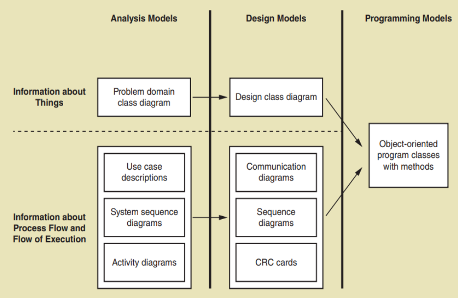

---

### System Perspectives  
- **External perspective:** Model the context or environment of the system (context models).  
- **Interaction perspective:** Model the interactions between a system and its environment, or between the components of a system (use case and sequence diagrams).  
- **Structural perspective:** Model the organization of a system (class diagram).  
- **Behavioral perspective:** Model the dynamic behavior of the system and how it responds to events (state diagram).  

---
### UML Diagram Types  

- **Activity diagrams:** Show the flow of activities involved in a process or in data processing.  
- **Use case diagrams:** Show the interactions between a system and its environment.  
- **Sequence diagrams:** Show interactions between actors and the system and between system components.  
- **Class diagrams:** Show the object classes in the system and the associations between them.  
- **State diagrams:** Show how the system reacts to internal and external events.  

---

### Use of Graphical Models  

- **As a means of facilitating discussion about a proposed system:** Incomplete and incorrect models are OK as their role is to support discussion.  
- **As a way of documenting an existing system:** Models should be an accurate representation of the system but may be incomplete.  
- **As a detailed system description that can be used to generate a system implementation:** Models have to be both correct and complete.  

---

### Interaction Models  

- Use case diagrams and sequence diagrams may be used for interaction modelling.  
- Use case models and sequence diagrams present interaction at different levels of detail and so may be used together.  
- The details of the interactions involved in a high-level use case may be documented in sequence diagrams.  

---

### Use Case Modelling  

- Use cases were developed originally to support requirements elicitation from stakeholders who interact directly with the system.  
- Each use case represents a discrete task that involves interaction with an external system.  
- Use cases just focus on automated processes.  
- Use Case diagrams aren't intended to show in which order the use cases are executed.  
- Use case name should start with a verb.    
- Use case diagrams give a fairly simple overview of an interaction, so you have to provide more detail to understand what is involved.  
- Further details can either be:  
	- A simple textual description  
	- A structured description in a table  
	- A sequence diagram  

---

### Diagrams in UML  
**The university wants to computerize its registration system:**  
- The Registrar sets up the curriculum for a semester.  
- Students select 3 core courses and 2 electives.  
- Once a student registers for a semester, the billing system is notified so the student may be billed for the semester.  
- Students may use the system to add/drop courses for a period of time after registration.  
- Professors use the system to set their preferred course offerings and receive their course offering rosters after students register.  
- Users of the registration system are assigned passwords which are used at login validation.  

---

### Actions in Use Case Diagram  

- The Registrar sets up the curriculum for a semester.  
- Students select 3 core courses and 2 electives.  
- Once a student registers for a semester, the billing system is notified so the student may be billed for the semester.  
- Students may use the system to add/drop courses for a period of time after registration.  
- Professors use the system to set their preferred course offerings and receive their course offering rosters after students register.  
- Users of the registration system are assigned passwords which are used at logon validation.  

---
### Use Case Diagram

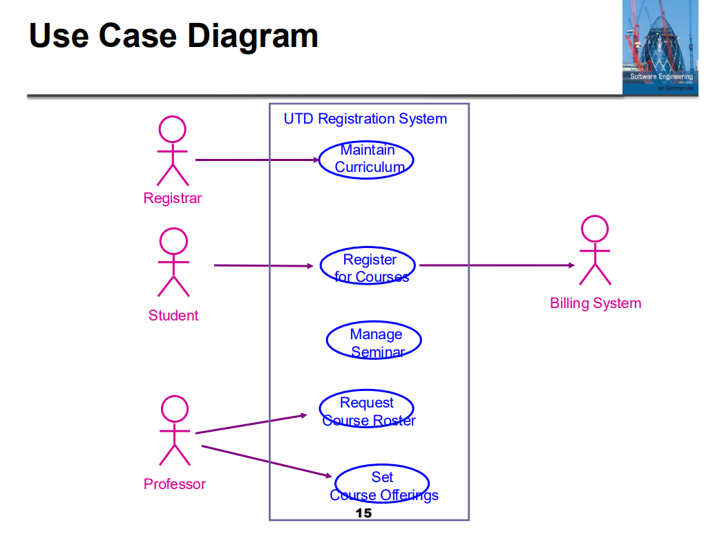

---

### Use Case Actors  
There are three types of actors:  
- **Users of the system:** Physical person, or a user who will be directly using the system.  
- **Other systems:** That will interact with the system being built.  
- **Time:** Time becomes an actor when the passing of a certain amount of time triggers some event in the system (out of control).  

---

### Use Case Actor  

- A use case in the Mentcare system:  
  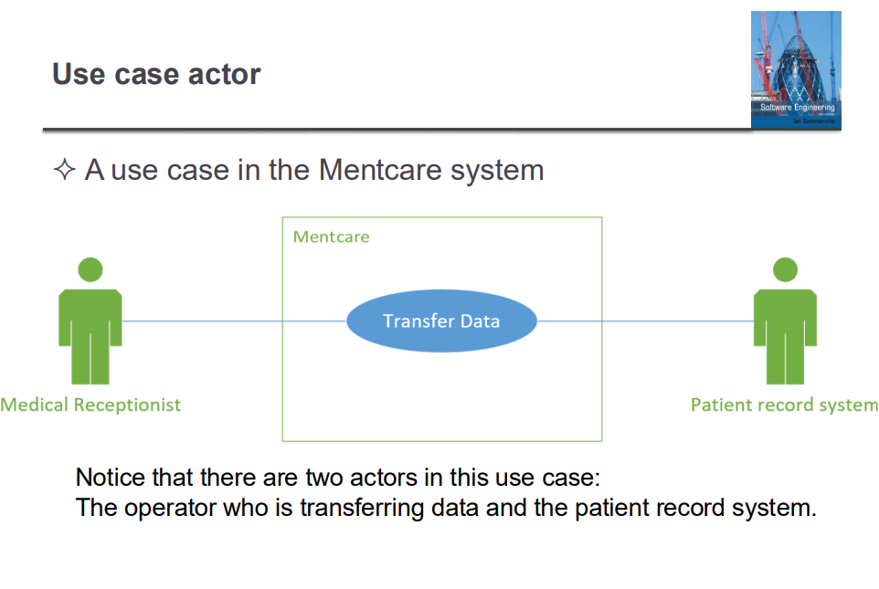  

---

### Use Cases for Actor 'Medical Receptionist'  

- The medical receptionist is responsible for:  
	- Register Patient  
	- Transfer Data  
	- Manage Patient Information  
	- Contact Patient  
- In case of emergencies, he can contact the patients via sms.

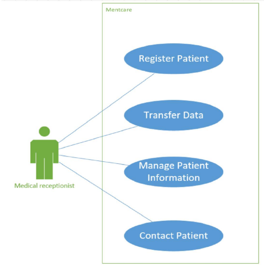

---

### Composite Use Case: Mentcare  

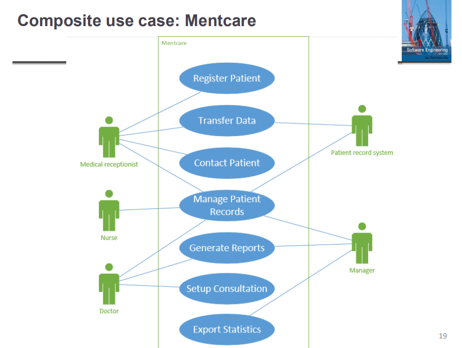

---

### Composite Use Case: Bank System  

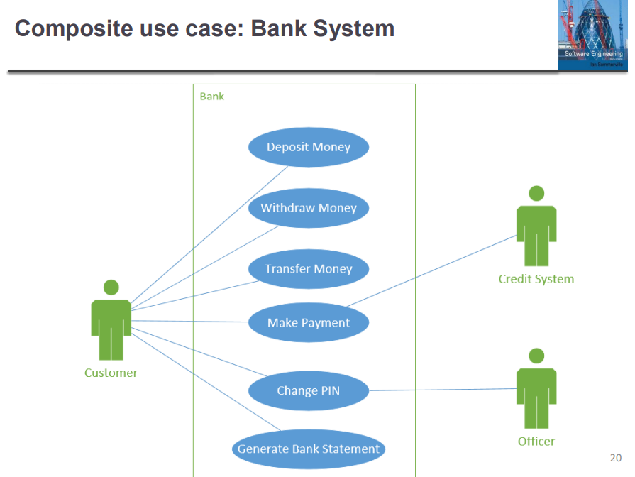

---

### Relationships  
- **Association:** Relationship between use case and an actor.  
- **Include:** One use case includes the functionality of another.  
- **Extend:** One use case optionally extends the functionality of another.  
- **Generalization:** the only relationship allowed between actors

---

### Association Relationship  

- Association relationship is used to show the relationship between a use case and an actor only.  
- Every use case must be initiated by an actor, with the exception of abstract use cases (in include and extend relationships).  

---

### Include Relationship  
- Include relationship allows one use case to use the functionality provided by another use case.  
- This relationship can be used in one of two cases:  
  - If two or more use cases have a large piece of functionality that is identical.  
  - A single use case has an unusually large amount of functionality.  

**Example:**  
- **Flight Reservation:** Make Reservation  
- **Check Credit:** While the "Make Reservation" use case is running, "Check Credit" must run.  

---

### Extend Relationship  
- Extend relationship allows one use case the option to extend functionality provided by another use case.  
- **Example:**  
  - **Flight Reservation:** Change Reservation  
  - **Check Credit:** While the "Change Reservation" use case is running, "Check Credit" runs if and only if the amount of the reservation has changed.  

---

### Abstract Use Cases  

- An abstract use case is not started directly by an actor.  
- Instead, an abstract use case provides some additional functionality that can be used by other use cases.  
- Abstract use cases are the use cases that participate in an include or extend relationship.  

**Example:**  
- **Flight Reservation:** Purchase Ticket  
- **Check Credit:** Include  
- **Change Reservation:** Extend  

---

### Reservation System Abstract Use Cases  

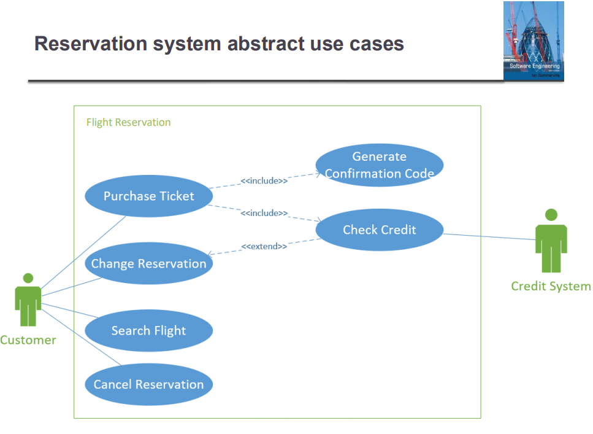

---

### Generalization  

- Generalization is shown as an arrowhead pointing up to the more general class.  
- The attributes and operations associated with higher-level classes are also associated with the lower-level classes.  
- Lower-level classes are subclasses, which inherit the attributes and operations from their superclasses.  

**Example:**  
- **Student:** Postgraduate, Undergraduate  

---

### Functionalities  

- Every use case should represent a main functionality.  
- Avoid creating use cases for steps of a process (e.g., "select seat" or "enter user name").  
- Avoid vague names like "enter data in database" or "manage data."  
- Combine related functionalities into a single use case (e.g., "Manage course" instead of "Add course," "Delete course," and "Update course").  

---

### Relationships  
- When you have a use case that is processed by the system itself, you cannot have a "system" actor.  
- The solution is to include it in another use case that is initiated by another user.  
- **Example:**  
  - **Create New Account:** Includes "Check Username Availability."  
  - **Actor:** User  

---

### Weather Station System Exercise  
- **Report Weather Data:** Employee reports weather data and the status of the weather station hardware.  
- **Issue Control Commands:** Technicians can issue specific weather station control commands, such as Restart, Shutdown, Power Saving, and Reconfiguration.  
- **Draw use case diagram for weather station system.**  
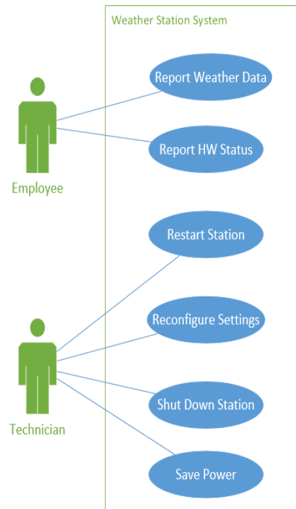

---

### Structural Models  

- Structural models of software display the organization of a system in terms of the components that make up that system and their relationships.  
- Structural models may be static models, which show the structure of the system design.  
- You create structural models of a system when you are discussing and designing the system architecture.  

---

### Class Diagrams  
- Class diagrams are used when developing an object-oriented system model to show the classes in a system and the associations between these classes.  
- An object class can be thought of as a general definition of one kind of system object.  
- An association is a link between classes that indicates that there is some relationship between these classes.  

---

### Class  

- Each class has a class name, a set of attributes (optional), and a set of methods (optional).  
- The scope of the attributes and methods can be specified (Private, Package, Protected, Public).  

**Example:**  
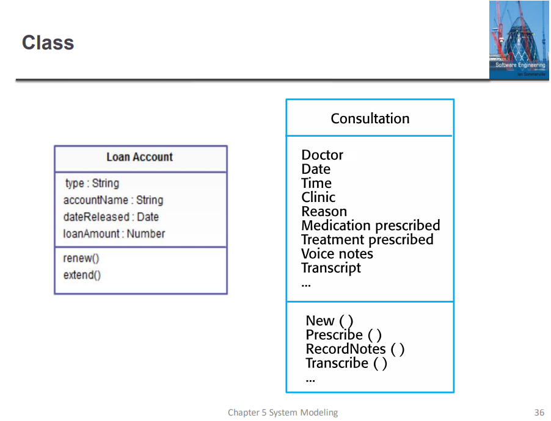

---

### Association  
- The association relationship describes a relationship between two classes where one class can use another class in some way.  
- Multiplicity property of the classes must be specified.  
- Relationship can be bidirectional (zero or two arrowheads) or unidirectional (one arrowhead).  
- It can optionally be assigned a meaningful name to describe how the two classes are associated.  
- A reflexive relationship describes a relationship between one class and itself.  

---

### Multiplicity Types  
| **Symbol** | **Meaning** |
|------------|-------------|
| 0          | None        |
| 1          | One         |
| m          | An integer value |
| m,n        | m or n      |
| 0..1       | Zero or one |
| m...n      | At least m, but not more than n |
| *          | Any nonnegative integer (zero or more) |
| 0..*       | Zero or more (identical to *) |
| 1..*       | One or more |

---

### Classes and Associations in the MHC-PMS 

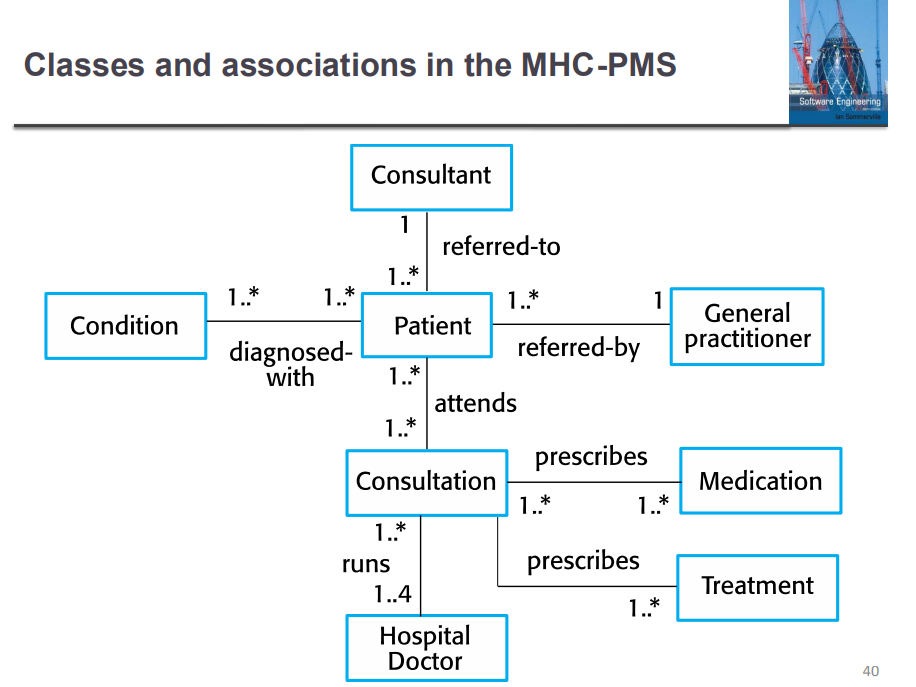

---

### Reflexive Association  
- **Airline Staff:** A staff member working in an airport may be a pilot, aviation engineer, a ticket dispatcher, a guard, or a maintenance crew member.  
- If the maintenance crew member is supervised by the aviation engineer, there could be a "supervise" relationship in two instances of the same class.  

---

### Generalization  
- In modeling systems, it is often useful to examine the classes in a system to see if there is scope for generalization.  
- In object-oriented languages, such as Java, generalization is implemented using the class inheritance mechanisms built into the language.  
- The lower-level classes are subclasses that inherit the attributes and operations from their super classes.  

---

### Generalization Hierarchy  
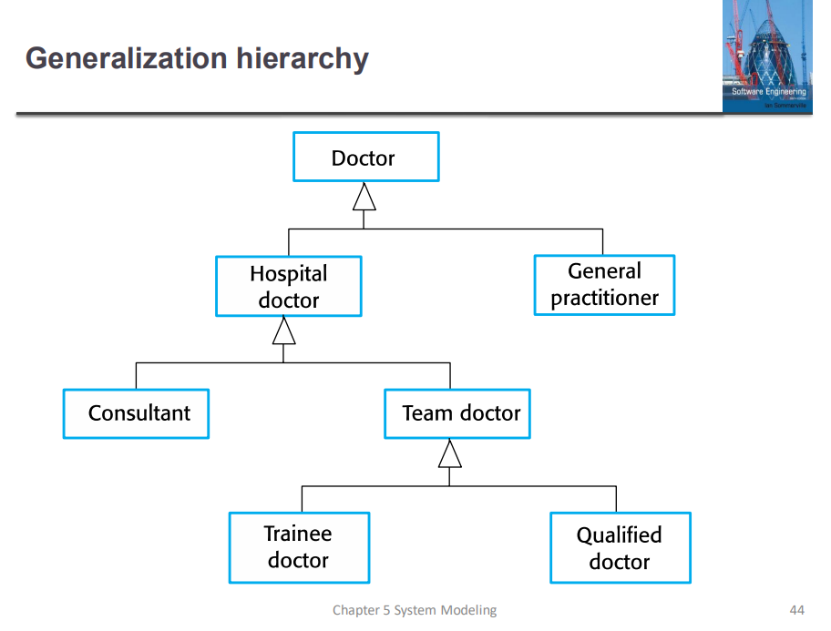  

---

### Object Class Aggregation Models  
- An aggregation model shows how classes that are collections are composed of other classes.  
- **Aggregation and composition associations:**  
	- **Aggregation:** A "HAS-A" relationship where the child can exist independently of the parent.  
	- **Composition:** A "WHOLE-PART" relationship where the child cannot exist independently of the parent.  

---

### Aggregation Association  
- **Car:** Wheel  
- **Employee:** Team  

---

### Composition Association  
- **Building:** Room  
- **Course:** Exam  

---

### Hospital Management System  
- The system keeps information related to doctors, patients, visits, and prescriptions.  
- Doctors can visit patients, examine them, add diagnoses, record symptoms, prescribe drugs, and schedule medical procedures.  
- Patients can register, unregister, confirm medical procedures, and request discharge.  
- Patient history can be accessed by doctors to make better judgments.  
- Patient status can be displayed anytime (e.g., hospitalized, intensive care, away, discharged).  
